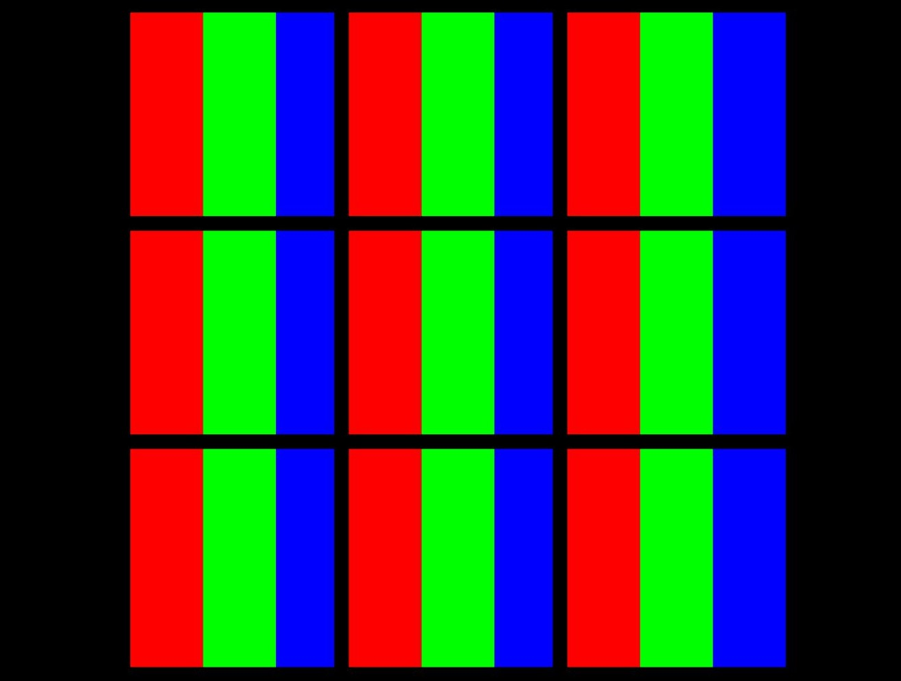

# project-vibgyor
### tinkering RGB led - making RGB led glow Violet -> Indigo -> Blue -> Green -> Yellow -> Orange -> Red
#
Let’s mimic the working of a pixel with help of RGB led.

Each pixel on a screen is typically made up of three tiny "lights"; one red, one green, and one blue. By increasing and decreasing the amount of light coming out of each of these three, all the different colours can be made.

pixels

So, to display RED colour, only red light among the three, of every pixel is on.

Likewise, to display GREEN colour, only green light among the three, of every pixel is on.
Same pattern is true for displaying BLUE colour.

Now, brightness can be represented in 256 levels (0 to 255).

0 represent off.       255 represent brightest.

 RGB colour codes chart gif

To display Violet -> Indigo -> Blue -> Green -> Yellow -> Orange -> Red 

We need to follow the order :->

Keeping R constant as 0 & B constant as 255 & G in increasing order (from 0 to 255)

Then

Keeping R constant as 0 & G constant as 255 & B in decreasing order (from 255 to 0)

Then

Keeping B constant as 0 & G constant as 255 & R in increasing order (from 0 to 255)

Then

Keeping B constant as 0 & R constant as 255 & G in decreasing order (from 255 to 0)
